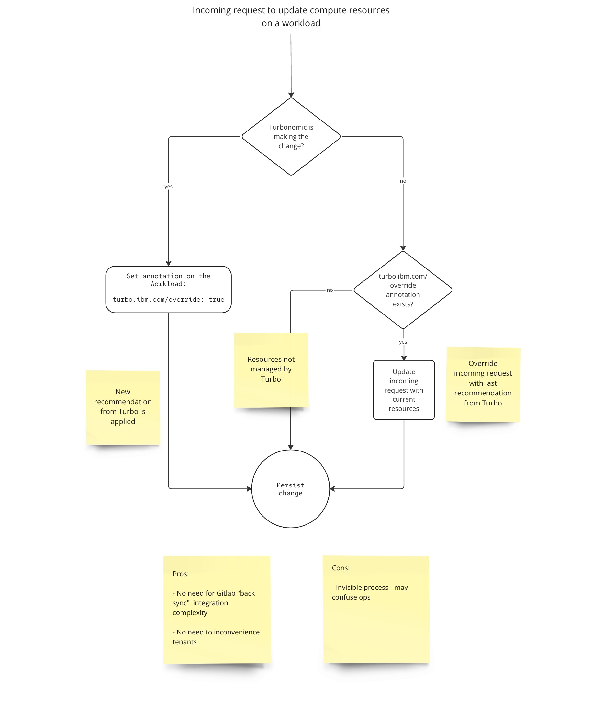

# turbonomic-companion-operator

[IBM Turbonomic](https://www.ibm.com/products/turbonomic) is an application resource management tool. This operator aims to address the conflict between the Source of Truth for application management and Turbonomic's optimizations.

A step by step description of a conflict scenario:

1. Turbonomic automatically right-sizes (makes changes to container resources) a workload running in a Kubernetes cluster.
2. Workload owner performs a release using their own CI/CD solution. They are using configurations stored in their Source of Truth (git repository most likely). The release reverts Turbonomic's optimization.
3. Later, Turbonomic automatically right-sizes the workload, again.
4. Turbonomic's optimization is effective until the next reconciliation from The Source of Truth.
5. Back and forth continues.

One way to solve this problem is by updating The Source of Truth accordingly. This is easier said than done, especially on multi-tenant clusters with heterogenous CI/CD solutions, but can be done using an [Action Script Server](https://www.ibm.com/docs/en/tarm/8.15.2?topic=scripts-setting-up-action-script-server) or [IBM Rapid Automation](https://community.ibm.com/community/user/aiops/blogs/raul-gonzalez/2024/12/12/seamlessly-integrate-turbonomic-with-cicd-pipeline).

This solution does not attempt to integrate with workload owner's Source of Truth. Instead, it makes Turbonomic the Source of Truth for workload resources. The advantage is that integration with the Source of Truth and related CI/CD - which can be challenging - is not needed. The disadvantage is introducing an additional Source of Truth (there should be just one really) and potentially confusing the owner ("the live workload resources do not match my Source of Truth - what is going on?").

Noting that this operator does not control which workloads are right-sized, when or how. All this is captured in policies defined in Turbonomic. Without Turbonomic, this operator does nothing.

## Workload owner documentation

### Infrequent reconciliation

If you're using a CI/CD solution to make updates to your workload infrequently (i.e. only during scheduled release windows), then this webhook will work for you out of the box.

When Turbonomic applies resource optimizations to your workload for the first time, it will be annotated with `turbo.ibm.com/override: "true"` annotation. From that moment on, only Turbonomic will be allowed to change the compute resources. If any other agent attempts it, the request will succeed, but compute resources will not be affected.

Note that you cannot remove the `turbo.ibm.com/override` annotation. To release the workload from Turbonomic's control, first remove it from Turbonomic (at least ensure Turbonomic's optimizations are not automatically applied) and then set the annotation to "false" to disable the webhook behavior.

### Continuous reconciliation with ArgoCD

If you're managing your workloads using ArgoCD, you need to do 2 things:

1.  Ignore compute resources [tracked by ArgoCD](https://argo-cd.readthedocs.io/en/stable/user-guide/resource_tracking/) to prevent ArgoCD from marking the workload out of sync.

    ```yaml
    apiVersion: argoproj.io/v1alpha1
    kind: Application
    spec:
      ignoreDifferences:
      - group: '*'
        kind: '*'
        jqPathExpressions:
        - .spec.template.spec.containers[].resources
    ```

    (see [diffing customization in ArgoCD documentation](https://argo-cd.readthedocs.io/en/stable/user-guide/diffing/))

2.  Explicitly annotate your workload with `turbo.ibm.com/override: "true"` annotation (do this in your Source of Truth) to protect Turbonomic's changes when the workload is synced from the Source of Truth. This operator will not manage the annotation automatically in this case because it does not know if you performed the first step. If you didn't, it would keep ArgoCD (and itself) busy with constant attempts to update the workload.

    You may wonder if it's not easier to just remove the compute resources from your Source of Truth instead. Perhaps it is. The advantage of having compute resources defined in the Source of Truth is that they will be used as defaults during initial workload creation (or re-creation from scratch, e.g. recovery). Turbonomic will optimize compute resources only for workloads which run for some time and generated enough utilization history.

## Metrics

### turbonomic_companion_operator_turbo_override_total

Dimensions:

* workload_namespace
* workload_kind
* workload_name

A counter indicating how many times the webhook prevented an update to compute resources on a given workload to keep the last recommendation from Turbonomic effective. If this is happening frequently (many times an hour), then you likely have a disagreement between the webhook and another agent trying to update compute resources. See 'Continuous reconciliation with ArgoCD' section above for details on one particular scenario.


## Implementation

Mutating webhook with logic following the activity diagram below:



## Testing

```sh
make test
```

## Building & deploying

```
make build . -t <image name>
podman push <image name>
make deploy IMG=<image name>
```
