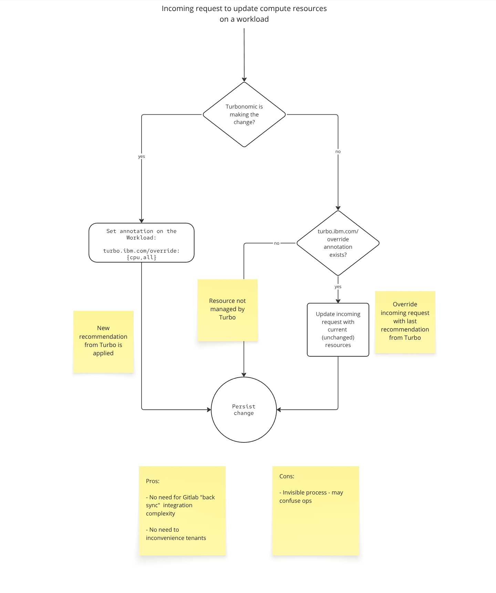

# turbonomic-companion-operator

[IBM Turbonomic](https://www.ibm.com/products/turbonomic) is an application resource management tool. This operator aims to address the conflict between the Source of Truth for application management and Turbonomic's actions.

A step by step description of a conflict scenario:

1. Turbonomic automatically right-sizes (makes changes to container resources) a workload running in a Kubernetes cluster.
2. Workload owner performs a release using their own CI/CD solution. They are using configurations stored in their Source of Truth (git repository most likely). The release reverts Turbonomic's actions.
3. Later, Turbonomic automatically right-sizes the workload, again.
4. Turbonomic's action is effective until the next reconciliation from The Source of Truth.
5. Back and forth continues.

One way to solve this problem is by updating The Source of Truth accordingly. This is easier said than done, especially on multi-tenant clusters with heterogenous CI/CD solutions - each tenant team owns their own git repository and CI/CD pipeline, which the platform team generally cannot access or modify. The Source of Truth "back sync" can be done, for example using an [Action Script Server](https://www.ibm.com/docs/en/tarm/8.15.2?topic=scripts-setting-up-action-script-server) or [IBM Rapid Automation](https://community.ibm.com/community/user/aiops/blogs/raul-gonzalez/2024/12/12/seamlessly-integrate-turbonomic-with-cicd-pipeline), but requires coordination with and buy-in from every tenant team.

The turbonomic-companion-operator works differently. It does not attempt to integrate with workload owner's Source of Truth. Instead, it makes Turbonomic the Source of Truth for workload's compute resources.

* The advantage is that integration with the Source of Truth and related CI/CD - which can be challenging - is not needed.
* The disadvantage is introducing an additional Source of Truth (there should be just one really) and potentially confusing the owner ("the live workload resources do not match my Source of Truth - what is going on?").

Noting that this operator does not control which workloads are right-sized, when or how. All this is captured in policies defined in Turbonomic. Without Turbonomic, this operator does nothing.

## Workload owner documentation

When Turbonomic applies resource optimizations to your workload for the first time, it will be automatically annotated with `turbo.ibm.com/override` annotation. From that moment on, only Turbonomic will be allowed to change the compute resources. If any other agent attempts it, the request will succeed (satisfying the other agent), but compute resources will not be affected and the values will stick to what was set by the last Turbonomic action.

`turbo.ibm.com/override` annotation can have 3 values:

* `cpu` - only cpu resources are managed by Turbonomic. Memory resources can still be changed by other agents. Set automatically when Turbonomic's first optimization only adjusted CPU.
* `all` - both cpu and memory are managed by Turbonomic. Neither cpu nor memory can be changed by other agents. Set automatically when Turbonomic adjusts memory resources (or both). The mode can upgrade from `cpu` to `all` as Turbonomic's scope grows, but never downgrades.
* `false` - explicitly releasing both cpu and memory from Turbonomic management (same as no annotation). This is the opt-out value — set it manually when you want to take back control of compute resources.

Note that you cannot remove the `turbo.ibm.com/override` annotation unless it's set to `false`. To release the workload from Turbonomic's control, first remove it from Turbonomic (at least ensure Turbonomic's actions are not automatically applied) and then set the annotation to "false" to disable the webhook behavior. Once set to "false", you can remove the annotation.

### Infrequent reconciliation

If you're using a CI/CD solution to make updates to your workload infrequently (i.e. only during scheduled release windows), then this operator will work for you out of the box.

### Continuous reconciliation with ArgoCD

If you're managing your workloads using ArgoCD, you need to ignore compute resources [tracked by ArgoCD](https://argo-cd.readthedocs.io/en/stable/user-guide/resource_tracking/) to prevent ArgoCD from marking the workload out of sync.

    ```yaml
    apiVersion: argoproj.io/v1alpha1
    kind: Application
    spec:
      ignoreDifferences:
      - group: '*'
        kind: '*'
        jqPathExpressions:
        - .spec.template.spec.containers[].resources
    ```

    (see [diffing customization in ArgoCD documentation](https://argo-cd.readthedocs.io/en/stable/user-guide/diffing/))

If you neglect doing that, ArgoCD will be frequently trying to reconcile the workload from the source of truth and this webhook will prevent the compute resources from being updated, ad infinitum.

## Implementation

The webhook distinguishes Turbonomic's requests from all other actors by the Kubernetes service account: Kubeturbo (the Turbonomic agent running in the cluster) uses the `system:serviceaccount:turbonomic-operator-system:turbo-user` service account, while every other actor — ArgoCD, kubectl, CI/CD pipelines — is treated as non-Turbonomic. When Kubeturbo acts, the webhook allows the change and sets or updates the `turbo.ibm.com/override` annotation based on which resources were modified. When any other actor attempts to update a managed workload, the webhook silently restores Turbonomic's last-known resource values while still returning a success response to the caller. Changes unrelated to compute resources (environment variables, image tags, replicas, etc.) are never affected.

Mutating webhook with logic following the activity diagram below:



## Metrics

### turbonomic_companion_operator_turbo_override_total

Dimensions:

* workload_namespace
* workload_kind
* workload_name
* workload_container

A counter indicating how many times the webhook prevented an update to compute resources on a given workload to keep the last action from Turbonomic effective. If this is happening frequently (many times an hour), then you likely have a disagreement between the webhook and another agent trying to update compute resources. See 'Continuous reconciliation with ArgoCD' section above for details on one particular scenario.

## Testing

```sh
make test
```

## Building & deploying

```
make build . -t <image name>
podman push <image name>
make install
make deploy IMG=<image name>
```
